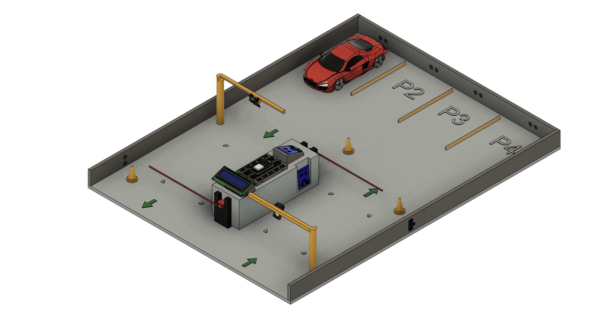
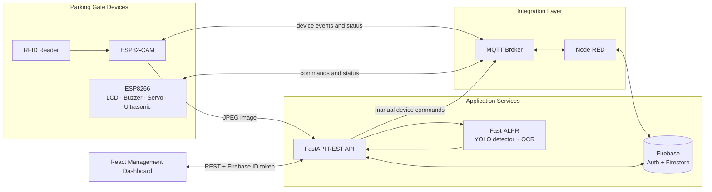

# Smart Parking System

An end-to-end IoT parking management platform that combines RFID authentication, automatic license plate recognition (ALPR), automated gate control, configurable billing, and a responsive management dashboard.


## Overview

Smart Parking System is a full-stack IoT prototype for automating vehicle entry and exit. A driver taps an RFID card, an ESP32-CAM captures the license plate, and the backend recognizes the plate using an ONNX-based ALPR pipeline. Node-RED coordinates the transaction through MQTT, persists operational data in Firestore, calculates parking fees, updates the RFID balance, and sends the result back to the physical gate.

The web application gives parking operators a single interface for monitoring occupancy and revenue, managing RFID cards and vehicles, configuring fees, reviewing system logs, checking device activity, and manually controlling the barrier, LCD, and buzzer.



## Engineering Highlights

- Built a complete IoT-to-cloud workflow across embedded devices, MQTT, Node-RED, FastAPI, Firebase, and React.
- Combined RFID identity with camera-based plate recognition to validate parking transactions.
- Implemented a state-machine workflow on the ESP32-CAM to prevent overlapping card, recognition, and gate events.
- Automated entry/exit records, time-based fee calculation, RFID balance deduction, system logging, and optional email notifications.
- Added sensor-assisted barrier closing: the ESP8266 waits for the vehicle to pass before closing the servo gate.
- Secured management APIs with Firebase ID tokens and protected frontend routes.
- Delivered a responsive Vietnamese-language dashboard with near-real-time polling, reusable data tables, and revenue/traffic charts.

## System Architecture



## Parking Workflow

1. The driver taps an RFID card on the reader connected to the ESP32-CAM.
2. The ESP32-CAM publishes the card UID to `smartparking/rfid/tap`.
3. Node-RED checks the RFID card and any active vehicle record in Firestore, then classifies the transaction as `IN` or `OUT`.
4. The ESP32-CAM captures a JPEG image and sends it to `POST /plate/recognize`.
5. Fast-ALPR detects the license plate and returns OCR results above the configured confidence threshold.
6. The ESP32-CAM publishes a vehicle entry or exit event containing the RFID UID and recognized plate.
7. Node-RED validates the transaction and updates Firestore:
   - Entry: creates a `parking` vehicle record and stores an audit log.
   - Exit: calculates the fee, marks the vehicle as `exit`, deducts the RFID balance, and stores an audit log.
8. The gate displays the result on the LCD, sounds the buzzer, and opens the barrier.
9. The ultrasonic sensor detects that the vehicle has passed, then the ESP8266 closes the barrier and returns to the ready state.

## Features

### Management dashboard

- Current vehicles in the parking lot
- Active RFID card count
- Today's revenue and configured hourly price
- Revenue and vehicle traffic chart for 7, 30, or 90 days
- Responsive sidebar layout with protected routes

### Parking operations

- RFID card creation, update, activation status, balance management, and deletion
- Vehicle history with parking/exit status, timestamps, RFID UID, plate, and fee
- Configurable hourly price, multiplier, maximum price, and additional charge
- Filterable system logs for vehicle entry, vehicle exit, and device events

### Device monitoring and control

- Camera and RFID reader activity status
- Custom messages on the 16x2 LCD
- Remote buzzer activation
- Manual barrier open/close commands
- Latest ALPR image preview with cache disabled

### Authentication and API security

- Firebase email/password sign-in
- Firebase ID token verification for management endpoints
- Client-side public/authenticated route guards

## Technology Stack

| Layer | Technologies |
| --- | --- |
| Frontend | React 19, Vite 7, Tailwind CSS 4, shadcn/ui, React Router 7 |
| Data fetching | TanStack Query 5 with cache invalidation and scheduled refetching |
| Visualization | Recharts |
| Backend | Python 3.10, FastAPI, Uvicorn, Pydantic |
| Authentication | Firebase Authentication |
| Database | Cloud Firestore |
| Computer vision | Fast-ALPR, YOLOv9 plate detector, OCR model, ONNX Runtime, OpenCV |
| Messaging and orchestration | MQTT, Eclipse Mosquitto-compatible broker, Node-RED |
| Embedded systems | ESP32-CAM, ESP8266, MFRC522 RFID, LCD I2C, servo, buzzer, ultrasonic sensor |

## Repository Structure

```text
smart-parking-system-web/
├── backend/
│   ├── main.py                  # FastAPI application and router registration
│   ├── models/                  # Pydantic request/response and Firestore models
│   ├── routers/                 # Auth, dashboard, CRUD, ALPR, and device APIs
│   ├── utils/                   # Firebase initialization and token verification
│   └── requirements.txt
├── frontend/
│   ├── src/components/          # Dashboard, data tables, forms, and UI primitives
│   ├── src/contexts/            # Authentication state
│   ├── src/pages/               # Application pages
│   ├── src/queries/             # TanStack Query API hooks
│   └── package.json
├── flows/
│   └── MainFlow_15082025.json   # Node-RED parking orchestration flow
└── sketch/
    ├── ESP32_Main/              # RFID, camera, ALPR request, and transaction state machine
    ├── ESP8266_Main/            # LCD, buzzer, barrier, and ultrasonic control
    └── libraries/               # Arduino dependencies used by the prototype
```

## Core Data Model

| Collection | Purpose | Main fields |
| --- | --- | --- |
| `rfid` | Registered parking cards | `uid`, `balance`, `dateAdded`, `status` |
| `vehicles` | Entry/exit history | `licensePlate`, `rfidUID`, `status`, `timeIn`, `timeOut`, `fee` |
| `feeConfig/defaultFee` | Active billing rules | `pricePerHour`, `multiplier`, `maximumPrice`, `additionalCharge` |
| `logs` | Operational audit trail | `type`, `message`, `dateLogged` |
| `deviceInfo/defaultInfo` | Device heartbeat/activity | `camLastRead`, `rfidLastRead`, `rfidUID` |

The exit fee is calculated by Node-RED as:

```text
hoursParked = ceil((timeOut - timeIn) / 1 hour)
usageFee    = min(hoursParked × pricePerHour × multiplier, maximumPrice)
finalFee    = usageFee + additionalCharge
```

## API Overview

FastAPI automatically exposes interactive documentation at `/docs` and `/redoc`.

| Group | Main endpoints | Authentication |
| --- | --- | --- |
| Authentication | `POST /auth/signup`, `POST /auth/signin` | Public |
| Dashboard | `GET /dashboard/stats`, `GET /dashboard/chart-data` | Firebase ID token |
| RFID cards | `GET/POST /rfid/`, `GET/PUT/DELETE /rfid/{uid}` | Firebase ID token |
| Vehicles | `GET /vehicles/`, `GET/PUT/DELETE /vehicles/{id}` | Firebase ID token |
| Fee configuration | `GET/PUT /fee-config/` | Firebase ID token |
| Logs | `GET /logs/`, `GET/DELETE /logs/{id}` | Firebase ID token |
| Device information | `GET/PUT /device-info/` | Firebase ID token |
| Device control | `POST /device-control/lcd/display`, `/buzzer/play`, `/servo/open`, `/servo/close` | Firebase ID token |
| Plate recognition | `POST /plate/recognize`, `GET /plate/recent-image` | Public device endpoint |

## Getting Started

### Prerequisites

- Python 3.10+
- Node.js 20+ and npm
- Firebase project with Email/Password Authentication and Firestore enabled
- MQTT broker on port `1883`
- Node-RED with MQTT, Firestore/Firebase Admin, and email nodes required by the imported flow
- Arduino IDE or PlatformIO for the ESP32-CAM and ESP8266 firmware

### 1. Configure Firebase

Create a Firebase service account key and keep it outside version control. In `backend/.env`, provide:

```env
FIREBASE_API_KEY=your_firebase_web_api_key
FIREBASE_CRED_PATH=absolute/or/relative/path/to/firebase-service-account.json
```

The frontend does not require direct Firebase SDK configuration because authentication is performed through the FastAPI endpoints.

### 2. Run the backend

The firmware currently sends ALPR requests to port `8080`, so the commands below use that port.

```bash
cd backend
python -m venv .venv
```

Activate the environment:

```bash
# Windows PowerShell
.venv\Scripts\Activate.ps1

# macOS/Linux
source .venv/bin/activate
```

Install dependencies and start FastAPI:

```bash
pip install -r requirements.txt
uvicorn main:app --reload --host 0.0.0.0 --port 8080
```

The first backend startup may take longer while the ALPR models initialize.

### 3. Run the frontend

Create `frontend/.env.local`:

```env
VITE_API_URL=http://localhost:8080
```

Then start Vite:

```bash
cd frontend
npm install
npm run dev
```

Open the URL printed by Vite, normally `http://localhost:5173`.

### 4. Configure Node-RED and MQTT

1. Start an MQTT broker on port `1883`.
2. Import `flows/MainFlow_15082025.json` into Node-RED.
3. Configure the MQTT broker, Firebase Admin connection, Firestore nodes, and optional email nodes.
4. Deploy the flow.
5. Verify that the `smartparking/#` topics can be published and subscribed to from the machine running Node-RED.

Important MQTT topics include:

| Topic | Direction | Purpose |
| --- | --- | --- |
| `smartparking/rfid/tap` | Device → Node-RED | Submit an RFID UID |
| `smartparking/rfid/tap-status` | Node-RED → Device | Return validation and IN/OUT decision |
| `smartparking/vehicle/in` | Device → Node-RED | Register a vehicle entry |
| `smartparking/vehicle/out` | Device → Node-RED | Register a vehicle exit |
| `smartparking/lcd/show` | Services → ESP8266 | Display a two-line message |
| `smartparking/buzzer/play` | Services → ESP8266 | Trigger the buzzer |
| `smartparking/servo/open` | Services → ESP8266 | Open the barrier |
| `smartparking/servo/close` | Services → ESP8266 | Start sensor-assisted barrier closing |

### 5. Flash the devices

1. Open `sketch/ESP32_Main/ESP32_Main.ino` and flash it to an AI-Thinker ESP32-CAM.
2. Open `sketch/ESP8266_Main/ESP8266_Main.ino` and flash it to the ESP8266 controller.
3. After each firmware boot, connect to the `ESP32CAM` and `ESP8266` Wi-Fi Manager access points (the current sketches reset saved Wi-Fi settings during startup).
4. Enter the Wi-Fi credentials and the LAN IP address of the MQTT/backend host.
5. Confirm that both boards connect to MQTT and that the FastAPI service is reachable from the ESP32-CAM on port `8080`.

## Production Hardening

This repository is an academic/prototype implementation. Before exposing it to a public network:

- Remove service-account files and device/network credentials from Git history, then rotate any credentials that may have been committed.
- Move MQTT host, port, and device configuration to environment variables or persistent provisioning storage.
- Enable MQTT authentication and TLS, and isolate device topics with broker ACLs.
- Restrict FastAPI CORS to trusted frontend origins.
- Add authorization roles for administrative actions and protect device-facing ALPR endpoints.
- Add automated tests, structured logging, rate limiting, health checks, and deployment configuration.
- Replace short-interval polling with event-driven updates where appropriate.

## Current Scope

The project demonstrates the complete parking workflow on a physical prototype. It is not yet packaged for one-command deployment and currently expects Firebase, MQTT, Node-RED, the API, and both microcontrollers to be configured separately on the same reachable network.

## Contributors

- Nguyễn Hoàng Quân
- Thái Hoàng Phúc
- Trần Tiến Cường